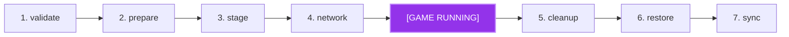

# Desktop Client Plugins Architecture & Guide

Client plugins in Drop run inside the desktop host (Tauri v2 + Vue 3). They allow community developers to extend the user interface, register alternative game launch actions, perform scoped file staging with reverse rollbacks, and execute allowlisted native binaries.

---

## The `ClientPlugin` Interface

```typescript
import type { ClientPlugin, ClientPluginContext } from "@drop-oss/plugin-sdk";

export default class ExampleClientPlugin implements ClientPlugin {
  metadata = {
    id: "example-client",
    name: "Example Client Plugin",
    version: "1.0.0",
    apiVersion: 2,
    targets: ["client" as const],
    capabilities: [
      "ui:slot" as const,
      "ui:play-action" as const,
      "ui:context-menu" as const,
      "game:launch-hook" as const,
      "game:fs" as const,
      "game:scan" as const,
      "system:command" as const,
    ],
  };

  async init(ctx: ClientPluginContext): Promise<void> {
    // Register UI slots, play actions, launch hooks, and context menus
  }

  async teardown?(): Promise<void> {
    // Cleanup handlers
  }
}
```

---

## 1. UI Slots (`ui:slot` Capability)

Client plugins can inject custom Vue components into designated UI slots across the application.

### Available Slots

| Slot Name               | Location            | Description                                     |
| :---------------------- | :------------------ | :---------------------------------------------- |
| `"game-detail:actions"` | Game details hero   | Custom action buttons alongside the Play button |
| `"game-detail:panels"`  | Game details body   | Injected cards, status views, and widgets       |
| `"game-detail:badges"`  | Game details header | Badges (e.g. "Multiplayer Ready", "Modded")     |
| `"settings:tabs"`       | Settings view       | Custom plugin configuration tabs                |
| `"topbar:status"`       | Top navigation bar  | Global indicators (e.g. VPN status, peer count) |
| `"sidebar:nav"`         | Left sidebar        | Additional primary navigation links             |

### Registering a Slot

```typescript
ctx.registerSlot(
  "game-detail:panels",
  {
    render() {
      const h = (globalThis.window as any)?.Vue?.h;
      return h(
        "div",
        { class: "rounded-xl border border-zinc-800 bg-zinc-900/60 p-4" },
        [
          h(
            "h4",
            { class: "text-xs font-semibold text-zinc-200" },
            "Custom Extension",
          ),
          h("p", { class: "text-xs text-zinc-400 mt-1" }, "Status: Active"),
        ],
      );
    },
  },
  { label: "My Panel", order: 10 },
);
```

> [!IMPORTANT]
> Do **not** register a `template:` string. Drop's production Vue build does not
> include the runtime template compiler (`vue/dist/vue.esm-bundler.js`), so a
> component created from a raw template string throws
> `Component provided template option but runtime compilation is not supported`
> and is caught by the plugin error boundary. Use a `render()` function
> (returning `h(...)` vnodes) or a precompiled component instead.

### Installed-Location Caveats for `system.run`

`ctx.system.run` executes allowlisted **bare executable names** only (never
paths). Resolution happens on the desktop host `PATH`. GUI sessions often omit
common daemon directories, so the host retries the following well-known
directories when the binary is not on `PATH`:

| Platform | Additional directories searched                                                                       |
| :------- | :---------------------------------------------------------------------------------------------------- |
| Linux    | `/usr/sbin`, `/usr/local/sbin`, `/opt/ZeroTier/One`                                                   |
| macOS    | `/Library/Application Support/ZeroTier/One`, `/usr/local/bin`, `/usr/local/sbin`, `/opt/homebrew/bin` |
| Windows  | `Program Files (x86)\ZeroTier\One`, `Program Files\ZeroTier\One`, `ProgramData\ZeroTier\One`          |

Windows batch wrappers (e.g. `zerotier-cli.bat`) are never executed — batch
files require a shell and are rejected by the no-shell execution model. Plugin
authors should invoke the underlying executable directly (e.g.
`zerotier-one.exe -q ...`) in their `manifest.client.commands`.

---

## 2. Play Actions (`ui:play-action` Capability)

Inspired by Playnite, Drop allows plugins to register dynamic startup actions for games. When a user clicks the dropdown next to "Play", your custom action appears as an option:

```typescript
ctx.registerPlayAction((gameId: string) => [
  {
    id: "play-lan-multiplayer",
    name: "Play LAN Multiplayer",
    icon: "heroicons:users",
    isDefault: false,
    execute: async (context: LaunchContext) => {
      ctx.logger.info(`Starting LAN multiplayer for ${context.gameTitle}...`);
      // Trigger game launch through Drop's pipeline
    },
  },
]);
```

---

## 3. Game Launch Pipeline & Reverse Rollbacks (`game:launch-hook`)

The launch pipeline enables plugins to inspect, prepare, and clean up game launches in coordinated stages.

### Pipeline Stages



1. **`pre-launch:validate`**: Integrity checks, anti-cheat scans. (Cancelable)
2. **`pre-launch:prepare`**: Downloading staged resources or configs. (Cancelable)
3. **`pre-launch:stage`**: Backing up and swapping executables or DLLs. (Cancelable)
4. **`pre-launch:network`**: Connecting to virtual mesh VPNs or lobbies. (Cancelable)
5. **`post-exit:cleanup`**: Removing transient scratch files.
6. **`post-exit:restore`**: Restoring original backups.
7. **`post-exit:sync`**: Cloud save synchronization.

### Fail-Closed Reverse Rollback

If **any** pre-launch hook throws an error, the launch is immediately aborted, and all previously completed pre-launch stages are rolled back in reverse order, ensuring the user's game directory is never left in a corrupted state.

```typescript
ctx.registerLaunchHook({
  stage: "pre-launch:stage",
  order: 10,
  execute: async (launchCtx: LaunchContext) => {
    // 1. Backup original DLL
    await ctx.gameFs.backupFile(launchCtx.gameId, "steam_api64.dll");

    // 2. Write custom wrapper
    await ctx.gameFs.writeFile(
      launchCtx.gameId,
      "steam_api64.dll",
      customBytes,
    );
  },
});

ctx.registerLaunchHook({
  stage: "post-exit:restore",
  order: 10,
  execute: async (launchCtx: LaunchContext) => {
    // Restore original DLL
    await ctx.gameFs.restoreFile(launchCtx.gameId, "steam_api64.dll");
  },
});
```

---

## 4. Scoped Game Filesystem (`game:fs` Capability)

Client plugins have safe, confined access to the active game's installation directory. The host rejects any path traversal (`..`) or symlink escaping the game's root directory:

```typescript
// Read, write, backup, restore, delete
const exists = await ctx.gameFs.fileExists(gameId, "config.ini");
await ctx.gameFs.writeFile(gameId, "custom.ini", "setting=1");
const backupPath = await ctx.gameFs.backupFile(gameId, "steam_api64.dll");
await ctx.gameFs.restoreFile(gameId, "steam_api64.dll");
```

---

## 5. Executable Scanning & File Search (`game:scan` Capability)

```typescript
// Scan all executables and compute SHA-256 hashes
const executables = await ctx.gameScanner.scanExecutables(gameId);
for (const exe of executables) {
  ctx.logger.info(
    `Found ${exe.relativePath} (hash: ${exe.sha256}, size: ${exe.size})`,
  );
}

// Search for files by path fragment. The host has no domain knowledge, so the
// plugin owns the meaning of the patterns (e.g. anti-cheat detection).
const matches = await ctx.gameScanner.findFiles(gameId, [
  "easyanticheat",
  "battleye",
]);
if (matches.length > 0) {
  ctx.logger.warn(`Anti-cheat indicators present: ${matches.join(", ")}`);
}
```

---

## 6. Allowlisted Native System Commands (`system:command` Capability)

Plugins that require native helper binaries (e.g. `zerotier-cli`) must declare them explicitly in `manifest.client.commands`:

```json
{
  "client": {
    "capabilities": ["system:command"],
    "commands": ["zerotier-cli"]
  }
}
```

At runtime, the host executes the binary directly without a shell, preventing shell injection:

```typescript
const result = await ctx.system.run("zerotier-cli", ["status"], {
  timeoutMs: 5000,
});
if (result.code === 0) {
  ctx.logger.info("ZeroTier status:", result.stdout);
}
```

Attempting to run a binary not declared in `manifest.client.commands` is blocked immediately.
